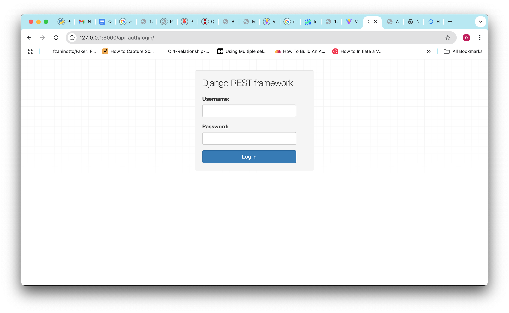
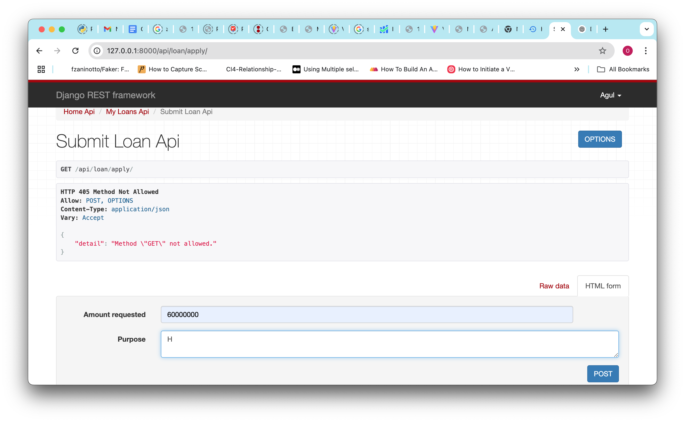
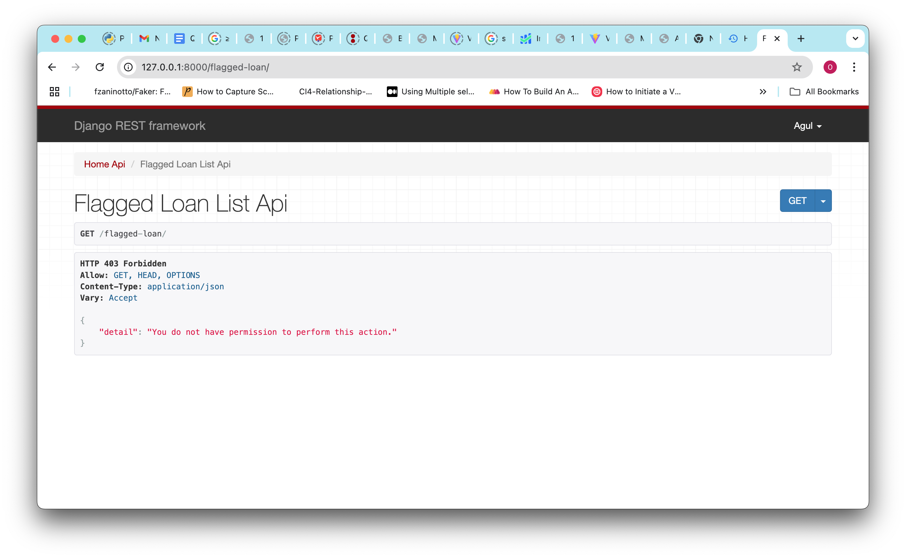
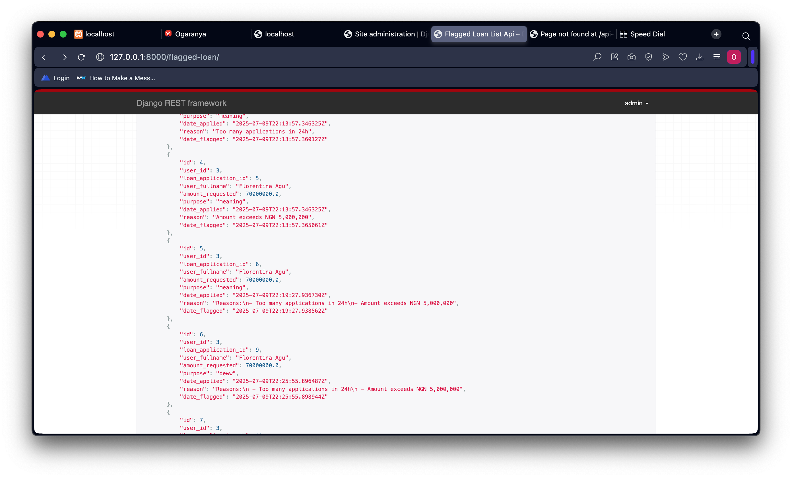
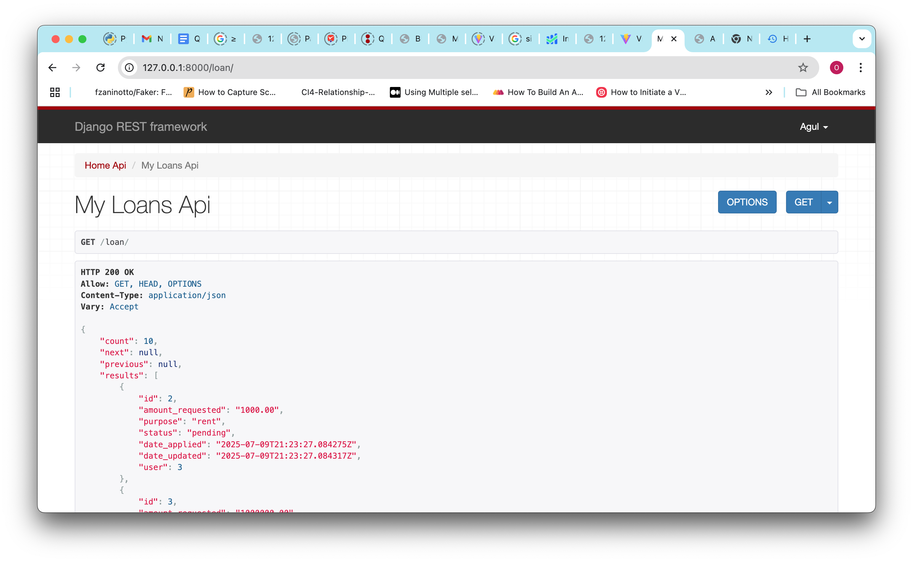
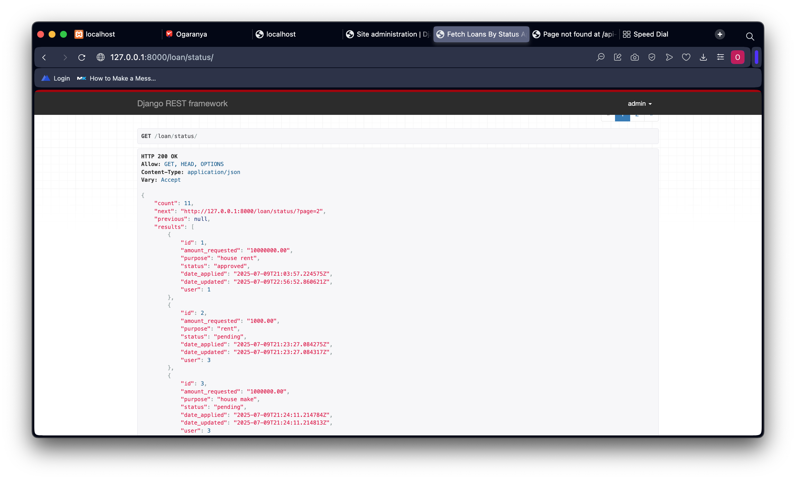

# Quickcheck Loan Management API

## Setup

1. Clone repo  
2. `python -m venv env && source env/bin/activate`  
3. `pip install -r requirements.txt`  
4. `python manage.py migrate`  
5. `python manage.py createsuperuser`  
6. `python manage.py runserver`

## Endpoints
- `GET /api`  
- Registration `POST /api/register/`  
- Login `POST /api/login/`
- Login To Be Authenticate on RestFrameWork View UI `/api-auth/login/`
- Logout `POST /api/logout/` 
- Loan Application `POST /api/loan/apply/`  
- Get Self Loan`GET  /api/loan/`  
- Admin Mark Loan `POST /api/loan/<id>/<approve|reject|flag>/`  (admin only) 
- Get all Flagged Loan with reasons`GET  /api/flagged-loan/` (admin only)  
- Get all loans(by status if pass)`GET  /api/loan/status/?status=<approved|rejected|pending>` (admin only)  


## Fraud Logic

1. >3 loans in 24h → flagged  
2. >Amount > 5,000,000 → flagged  
3. >Email-domain used by >10 users → flagged  

#### Flagged loans trigger an admin email.
Mails print to terminal

## Tests

```bash
python manage.py test
```
## Adds
- A standardized self-formatted response structure to unify all API outputs.
- Utility functions to implement the DRY principle.

## Images
>login to register token for restframework view UI


> Loan Application


> User permission denied on Admin Role


> Flagged Loan 


> Self View Loan


>Pagination
